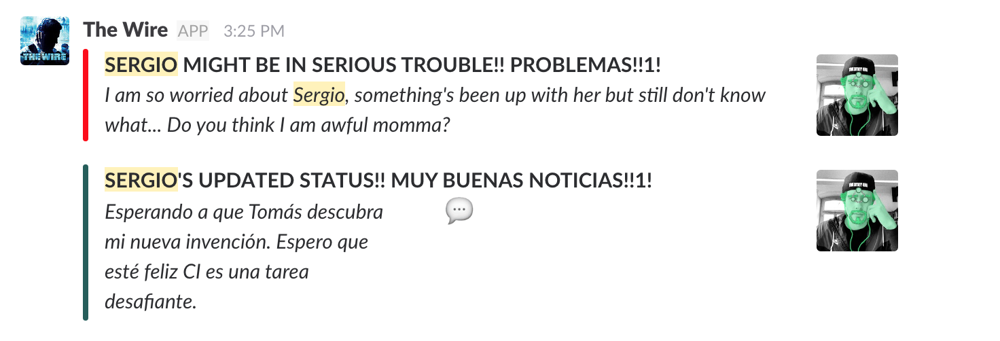

# the-wire

A minimalistic do-it-for-the-lolz app named after one of the HBO classic television show whose main purpose is to keep track of the modifications of the users status of a given Slack team by posting them into a designated channel.

Currently, the Slack messages sent by this application falls in two different categories depending on the event which triggered it: unsetting state vs updating state as the figure shown below indicates.

## Usage

Having installed your custom Slack application in your team, provide `WEBHOOK_URL` and `TOKEN` when executing `lein run`.

## License

Copyright © 2017 FIXME

Distributed under the Eclipse Public License either version 1.0 or (at
your option) any later version.
